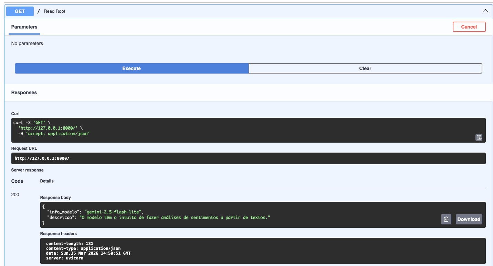
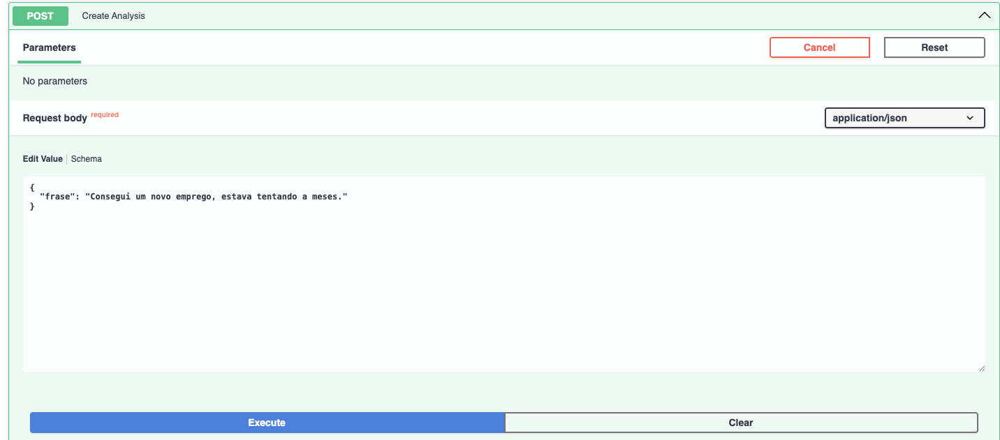
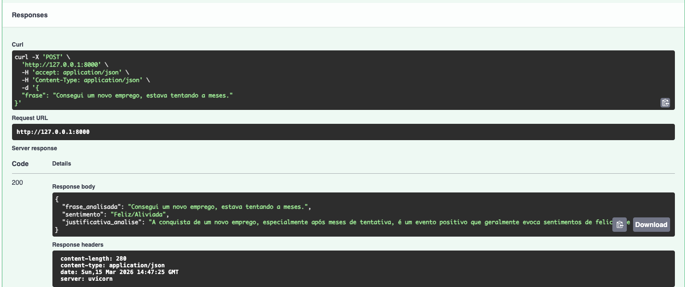
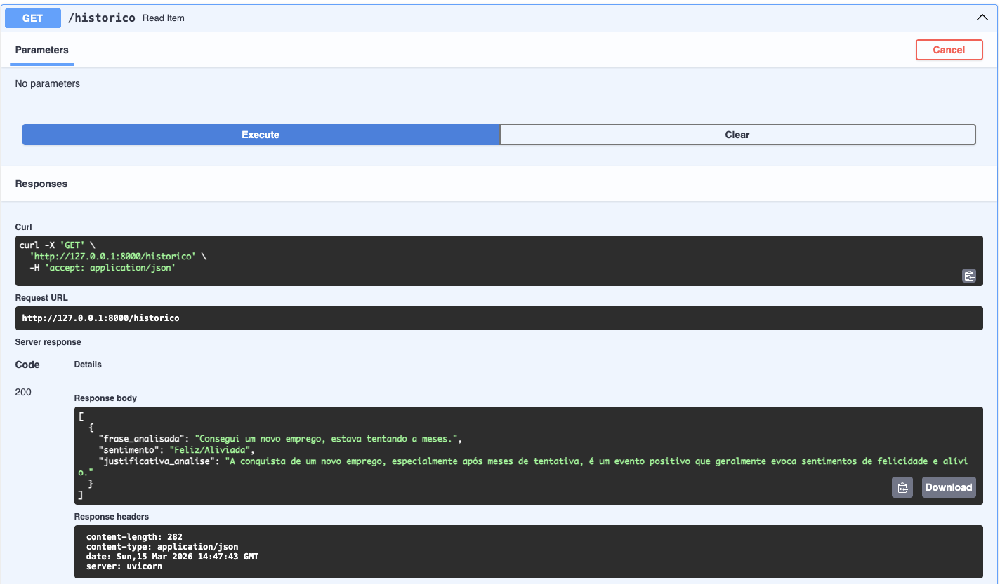
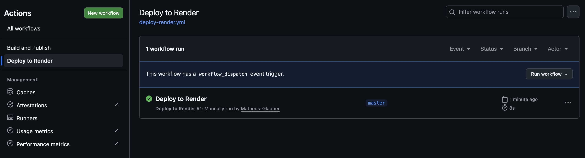
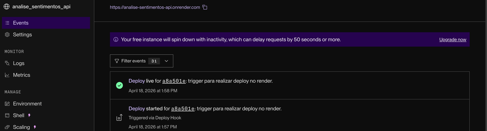
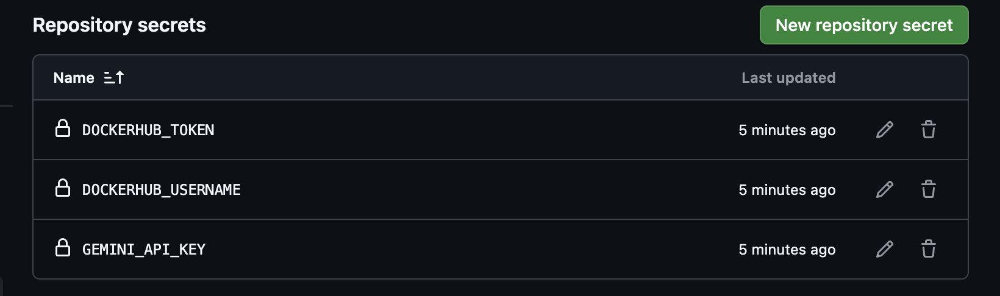
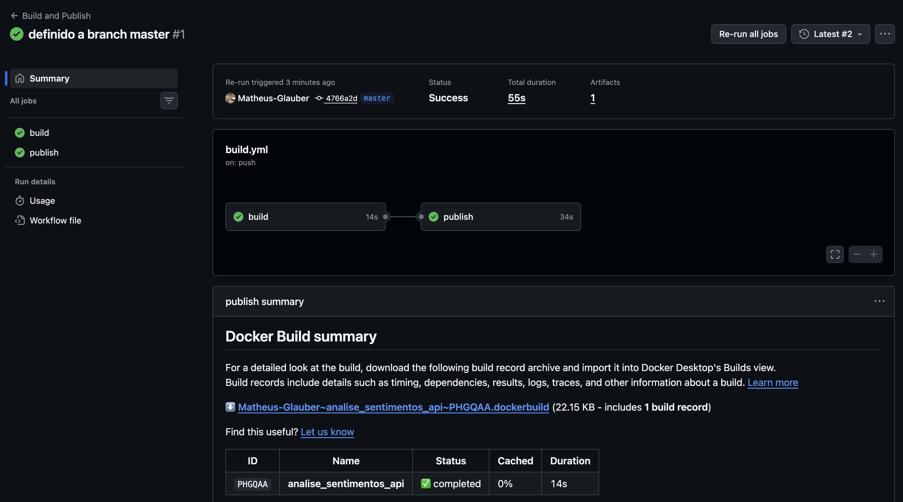
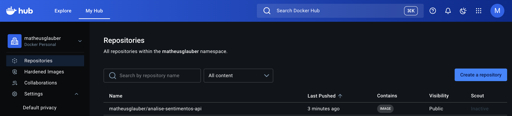

# Análise de Sentimentos API

## Propósito

API para análise de sentimentos de textos utilizando o modelo **Gemini 2.5 Flash Lite** do Google. Dado uma frase, o modelo retorna o sentimento identificado (feliz, triste, empolgado, etc.), a frase analisada e uma justificativa da análise, tudo estruturado em JSON.

---

## Observação antes de rodar

É necessário criar um .env no projeto com o valor GEMINI_API_KEY, tutorial de como gerar aqui: [Como usar chaves da API Gemini](https://ai.google.dev/gemini-api/docs/api-key?hl=pt-br)

---

## Como criar uma venv

Para isolar as dependências do projeto, crie um ambiente virtual Python:

```bash
python3 -m venv venv
```

Ative o ambiente virtual:

- **macOS/Linux:**
  ```bash
  source venv/bin/activate
  ```
- **Windows:**
  ```bash
  venv\Scripts\activate
  ```

---

## Como instalar as dependências

Com a venv ativada, instale as dependências listadas no `requirements.txt`:

```bash
pip install -r requirements.txt
```

---

## Rodando o projeto

```bash
fastapi dev main.py
```

Acesse a documentação interativa em: [http://localhost:8000/docs](http://localhost:8000/docs)

---

## Rotas

### `GET /`

Retorna informações sobre o modelo utilizado pela API.



---

### `POST /`

Recebe uma frase e retorna a análise de sentimento em formato JSON, contendo:

- `frase_analisada`: a frase enviada
- `sentimento`: o sentimento identificado
- `justificativa_analise`: explicação da análise

**Exemplo de requisição:**



**Exemplo de resposta:**



---

### `GET /historico`

Retorna o histórico de todas as análises realizadas na sessão atual.



---

## CI/CD

### Repository Secrets

Para o funcionamento da pipeline, foram configuradas as seguintes variáveis de ambiente como **Repository Secrets** no GitHub:

- `DOCKERHUB_USERNAME`: usuário do Docker Hub
- `DOCKERHUB_TOKEN`: token de acesso do Docker Hub
- `RENDER_DEPLOY_HOOK_URL`: URL do Deploy Hook do serviço no Render

---

## Deploy no Render

O deploy da aplicação no [Render](https://render.com) é feito de forma **manual** através de um workflow do GitHub Actions.

### Como realizar o deploy

1. No repositório do GitHub, acesse a aba **Actions**
2. No menu lateral, selecione o workflow **Deploy to Render**
3. Clique no botão **Run workflow** e selecione a branch desejada (ex: `master`)
4. O workflow irá disparar o Deploy Hook do Render, que inicia o build e deploy da aplicação automaticamente



### Interface do Render

Após o deploy ser disparado, é possível acompanhar o status na interface do Render. O painel de **Events** mostra o histórico de deploys, incluindo o commit associado e se foi acionado via Deploy Hook.



> **Nota:** No plano gratuito do Render, a instância entra em modo de inatividade após um período sem requisições, o que pode causar um atraso de ~50 segundos na primeira requisição após a inatividade.



---

### Pipeline - GitHub Actions

Foi criada uma pipeline no GitHub Actions (`.github/workflows/build.yml`) que realiza automaticamente o **build** e a **publicação** da imagem Docker do projeto no Docker Hub a cada push na branch `master`.

A pipeline possui dois jobs:

1. **build**: instala as dependências e verifica a sintaxe do código.
2. **publish**: faz login no Docker Hub, realiza o build da imagem e publica com a tag `latest`.



---

### Imagem no Docker Hub

A imagem está disponível publicamente no Docker Hub. Para baixá-la, execute:

```bash
docker pull matheusglauber/analise-sentimentos-api:latest
```

Para rodar o container:

```bash
docker run -d -p 8000:8000 -e GEMINI_API_KEY=<sua-chave> matheusglauber/analise-sentimentos-api:latest
```


